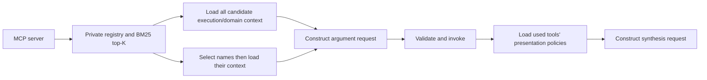

# modern-mcp

A read-only bookstore MCP server using the **official `mcp==2.2.0` SDK** and `MCPServer`, the official successor to FastMCP. Includes seven typed tools, local JSON tool context, a deterministic BM25 registry, and two offline LangGraph examples. No hosted model or embedding API is required.

## What makes this server different

The central feature is a **versioned tool context contract** that a client can discover, retrieve, and load in stages. A short tool description remains useful for choosing a tool; detailed calling rules, domain definitions, and answer-format policies live in separate documents. The reference client demonstrates how to keep those documents out of a permanent system prompt and load them when needed.

For example, “books imported last month” needs more than a function name: imports mean vendor stock receipts, date bounds must match the same receipt, catalog books are distinct from received units, and “last month” uses the fixture's calendar. A receipt report should show quantities and dates; one book's available stock can be a scalar; a sales series can suggest a chart. Each tool has its own execution, domain, and presentation documents for these differences.

This combines standard MCP features—schemas, structured results, annotations, resources, and prompts—with a **project-specific metadata namespace and client loading policy**. Those standard features are available to other MCP servers too. The distinctive experiment here is their organization into a discoverable registry with measured context-loading flows. Installing this server in an ordinary host does not automatically enable that policy: the host must implement the registry behavior or use the reference client.

The four categories have separate consumers and lifetimes:

- **Retrieval metadata:** inline summaries, keywords, and example queries feed client-side BM25. They are excluded from every constructed model request, together with retrieval scores.
- **Execution instructions:** referenced JSON documents explain when to call a tool and how to populate its parameters. They load before the model generates arguments.
- **Domain knowledge:** referenced JSON documents define terminology, accounting rules, and examples. They load alongside execution instructions, before argument generation.
- **Presentation policy:** referenced JSON documents specify scalar/detail/table/chart preferences, source links, and required facts. They load for tools actually used, before answer synthesis.

Schemas enforce machine-checkable input and output constraints. Context documents supply guidance that schemas cannot express conveniently; they are not a substitute for validation or proof that a model will follow instructions. Tool results enter synthesis as untrusted data, separate from the policy blocks.

## Install and run

Requires Python 3.14 and uv. From the repository root:

```powershell
uv sync --frozen --extra examples
uv run --frozen --extra examples modern-mcp
```

The second command serves MCP on stdio and waits for a client. For loopback Streamable HTTP:

```powershell
uv run --frozen --extra examples modern-mcp --transport streamable-http --port 8000
```

The HTTP endpoint is `http://127.0.0.1:8000/mcp`. Runtime-only installation can use `uv sync --frozen --no-dev` or `pip install -e .`. LangGraph is an optional `examples` extra. An MCP host can launch the absolute project interpreter (`.venv/Scripts/python.exe` on Windows or `.venv/bin/python` on Unix) with arguments `-m modern_mcp`; no shared working directory is required.

## Tool context and client boundary

Every tool advertises `_meta["modern_mcp/tool_context"]` with inline `retrieval`, plus `execution_instructions`, `domain_knowledge`, and `presentation_policy` references containing URI, SHA-256, and media type. [tool_contexts.json](src/modern_mcp/context/tool_contexts.json) is the authoring manifest; 21 locally packaged JSON documents are exposed through immutable MCP resource URIs. Startup rejects missing, invalid, mismatched, or oversized documents.

MCP metadata does not automatically hide retrieval data or inject instructions. [ToolContextRegistry](src/modern_mcp/registry.py) keeps raw definitions/retrieval data private and explicitly constructs model-facing requests. Retrieval-only sentinel tests cover selection, argument, and synthesis requests.



The request dictionaries are provider-neutral. A future model adapter converts their selected definitions into its provider's tool format and passes the projected instructions **before** calling the model. Never forward raw registry objects, metadata, or retrieval scores.

The JSON files are local to the **server package**. Clients fetch their contents through MCP `resources/read`; they do not need access to the server filesystem. References identify a category, tool, media type, and SHA-256 content digest. The registry verifies identity and hashes, caches verified documents, and rejects stale or altered prepared contexts. These checks detect inconsistent content; hashes do not authenticate an untrusted server.

## Numbers: what the experiment demonstrates

Reproduce the measurements with:

```powershell
uv run --frozen --extra examples python -m examples.offline_experiment
```

The generated `artifacts/offline-experiment.json` contains per-query retrieval results and per-stage request sizes. Artifacts are ignored by Git; generate the report locally. The [measurement code](examples/offline_experiment.py) and [28 retrieval cases](examples/retrieval_cases.json) are committed.

For **“Show books imported last month from vendor A”**, with a scripted call to `get_books`, the measured baseline loads all seven tools' execution, domain, and presentation context: **21 category documents, 24,425 serialized request bytes, and two prospective model stages**. Against that baseline:

- **K=3, hydrate candidates:** three candidates; seven category documents loaded; eight cold resource reads; two stages; **11,892 bytes, a 51.3% reduction**.
- **K=3, select names first:** three candidates but one selected tool; three category documents loaded; four cold resource reads; three stages; **8,274 bytes, a 66.1% reduction**.
- **K=1:** both flows load three category documents and make four cold reads. Hydrating directly uses **7,636 bytes**; selecting first uses **7,959 bytes**. With only one candidate, the extra selection stage adds overhead.
- **K=7:** the positive-score gate returns six candidates. Direct hydration uses **19,000 bytes** and 13 documents; selecting the one used tool first uses **8,693 bytes** and three documents.
- **Warm repeats:** both flows make **zero additional resource reads** in every measured configuration, using the registry's verified cache.

Cold read counts include one public fixture-reference read; category-document counts exclude it. Presentation documents are loaded only for the used tool in either dynamic flow. At K=3, selecting names first uses **30.4% fewer request bytes than hydrating all candidates**, at the cost of another prospective model stage.

The retrieval corpus has 21 single-tool queries, four queries requiring two tools, and three unrelated queries. Across the 25 positive cases, **mean recall@1 is 84%, mean recall@3 is 100%, and mean precision@3 is 43.3%**. Recall is the fraction of required tools recovered per query, then averaged; it is not a classification-accuracy score. Precision uses the number of candidates actually returned, which can be fewer than K. All three unrelated queries return no candidates. The precision result shows that a wider gate also admits extra tools.

These are **provider-neutral JSON request bytes, not tokens, MCP wire traffic, latency, cost, or model-quality measurements**. The context-size comparison uses one query and scripted adapters. Its baseline is an all-context client with comparable instructions, not a bare name/description server that provides less guidance. The authored corpus is small; neither it nor the 100-book fixture establishes production-scale performance.

## Where this approach helps

It is most useful when tools have substantial, distinct calling rules and domain documentation, while each user request uses only a small subset. Selecting one tool at K=3 loads three category documents instead of the baseline's 21. Versioned resources make that selective context verifiable and reusable across requests. Bounded result pages separately control how much bookstore data each call returns; metadata retrieval and result pagination solve different size problems.

Use **hydrate candidates** when choosing the correct tool itself needs domain context, or when the candidate set is already small. Use **select then hydrate** when concise names/descriptions support selection and each candidate has sizeable documentation. The latter deliberately asks the model to choose names before seeing detailed rules; it can choose poorly. Both flows load execution/domain context before generating arguments. The current experiment measures the size tradeoff, not which flow produces better model decisions.

For a few simple tools with short instructions, the extra machinery may offer little benefit. BM25 requires lexical overlap: deterministic ranking does not guarantee semantic relevance. Dense retrieval, real-model evaluation, automatic resource-change subscriptions, a full paging/replanning agent, and native skills-extension support remain future work.

## Seven tools

- `get_books`: distinct catalog books with genre/vendor/receipt-date filters and same-receipt matching.
- `get_book_details`: exact-ID facts and received/sold/stock totals.
- `list_stock_receipts`: arrival rows, quantities, and full-match totals.
- `get_stock_availability`: snapshot stock, including low/out-of-stock filters.
- `get_vendor_summary`: one vendor's supply totals and genre breakdown.
- `get_sales_trends`: sold units by day/week/month, including zero buckets.
- `compare_vendors`: supply volume over one common period.

Each has enforced flat input schemas, typed output schemas, structured results, and read-only annotations. The public SDK adapter rejects extra arguments; official SDK return validation remains active. List pages default to 20 rows, cap at 50, and have stable query/dataset-bound cursors. Totals cover the complete matched set. Empty results succeed; errors use `isError` and stable codes.

## Fixtures, resources, and calendar

[bookstore.json](src/modern_mcp/fixtures/bookstore.json) contains **100 books, 300 receipt rows, 200 sales, and four vendors**. The fixed snapshot is **2026-09-26**, Asia/Kolkata; coverage is `[2026-03-01, 2026-09-27)`. Stock is received units minus sold units, without returns/reservations/backorders or revenue data.

Dates are paired ISO bounds, start included and end excluded. Last month is `[2026-08-01, 2026-09-01)`, using the fixture clock. Books are `B001`–`B100`; vendors are `VENDOR-A`–`VENDOR-D`. B001 has 20 received/3 sold/17 remaining units; B002 is out of stock, B003 has 3 units, and B100 was never supplied.

Public resources: `bookstore://reference`, `bookstore://fixtures/bookstore-demo-v1`, and `bookstore://books/{book_id}`. Results carry source URIs and the fixture digest. Registry snapshots also include the fixture reference; mismatched results are rejected. Explicit `refresh()` rebuilds discovery, index, snapshot, reference, and context cache together. Context files are static during a process: restart and reconnect/refresh after authoring changes. There is no automatic subscription watcher in this reference.

Prompts `review_imports` and `compare_vendor_supply` are optional templates using paired ISO dates and comma-separated vendor IDs. They neither execute tools nor replace pre-call context loading. Skills-extension implementation is deferred; resources and prompts are the compatible baseline for the selected SDK.

## Offline examples

```powershell
uv run --frozen --extra examples python -m examples.registry_reference
uv run --frozen --extra examples python -m examples.langgraph_context_flows
uv run --frozen --extra examples python -m examples.offline_experiment
```

The registry example prints client-only rankings separately from the prospective model request. The graph example uses a clearly labeled scripted adapter against a real stdio server to demonstrate both loading flows. It loads presentation policies only for used tools before synthesis. Defaults support scalar/text, tables, genuine source hyperlinks, and charts with a text fallback; user formats override defaults while factual requirements remain.

Use `--url http://127.0.0.1:8000/mcp` with the first two examples for HTTP. The graph example's `--query`, `--tool`, and `--arguments` configure its **scripted** call; calls outside the retrieved/hydrated set are rejected. Replace its `Adapter` methods for a future model integration. [display_plan](src/modern_mcp/presentation.py) is a deterministic test fixture, not a chart renderer or model.

The small graph permits one call per tool per run. Registry/server pagination supports repeated calls, but a production paging/replanning agent loop is outside this example.

## Use the registry in your own client

The smallest integration follows discovery → private retrieval → hydration → argument generation → validated invocation → presentation hydration. This runnable sample uses an explicit offline call in place of a model:

```python
import asyncio
import sys

from mcp import Client
from mcp.client.stdio import StdioServerParameters
from modern_mcp.registry import ToolContextRegistry


async def main():
    target = StdioServerParameters(
        command=sys.executable, args=["-m", "modern_mcp"]
    )
    async with Client(target) as client:
        registry = ToolContextRegistry(client, "local-bookstore")
        await registry.refresh()
        query = "Show books imported last month from vendor A"
        names = [name for name, score in registry.retrieve(query, k=3)]
        if not names:
            return  # Ask for clarification or use another discovery path.
        prepared = await registry.hydrate(names)
        argument_request = registry.argument_request(query, prepared)
        # Model boundary: pass argument_request to an adapter to generate calls.
        # This offline sample supplies the call explicitly instead.
        start, before = await registry.relative_window("last month")
        result = await registry.invoke(prepared, "get_books", {
            "received_from": start,
            "received_before": before,
            "vendor_ids": ["VENDOR-A"],
        })
        synthesis_request = await registry.synthesis_request(
            query, {"get_books": result}, prepared.snapshot
        )
        # Model boundary: synthesize using policy blocks and result data.
        print("Argument request fields:", list(argument_request))
        print("Synthesis request fields:", list(synthesis_request))


asyncio.run(main())
```

For the second flow, use `selection_request(query, names)` first, obtain selected names from the adapter, call `validate_selection(names, selected)`, and hydrate only `selected`. The [LangGraph sample](examples/langgraph_context_flows.py) implements both flows and their failure paths. Its `Adapter` methods are the three integration seams: `choose_names`, `generate_calls`, and `synthesize`. Replace the scripted adapter with your model implementation; convert the projected `input_schema` to the provider's tool schema and deliver the supplied instruction blocks at the corresponding stage.

Keep the registry in private application dependencies rather than sending it as model-visible state. Call `refresh()` on reconnect or after a server/context update, and regenerate prepared requests afterward. A call must belong to its hydrated set and pass input validation; successful structured output must match its schema and the discovered fixture digest. Each tool's presentation block remains separate during synthesis, so multiple tools can retain different formatting policies.

The experiment writes `artifacts/offline-experiment.json`: 28 authored retrieval cases and context comparisons at K=1/3/7 against an all-seven/full-context baseline. It reports request **bytes**, document counts, cold/warm read calls, and prospective model stages. These are not model tokens or evidence of LLM quality. Positive BM25 scores do not guarantee relevance; this small corpus and 100 books are not general retrieval or scale benchmarks.

## Verify and author

```powershell
uv run --frozen --extra examples python -m pytest -q
uv run --frozen --extra examples ruff check src examples scripts tests
uv run --frozen --extra examples ruff format --check src examples scripts tests
```

Tests cover accounting, dates, same-receipt matching, pagination, schemas/errors, malformed context, hashes, retrieval privacy, snapshot refresh, fixture consistency, graph ordering, presentation fallbacks, stdio from another directory, and HTTP. Temporary transport processes are closed after testing.

Explicitly regenerate initial fixtures/context with `python scripts/generate_fixtures.py` and `python scripts/generate_context.py` in the project environment. Runtime reads committed JSON, never these scripts. The context generator overwrites the initial document set: update it along with JSON when preserving regeneration behavior.

Design references: [specification](.scratch/bookstore-context/spec.md), [publication contract](docs/design/tool-context-contract.md), [flow design](docs/design/context-loading-flows.md), [SDK research](docs/research/mcp-v2-registry-langgraph.md), and [glossary](CONTEXT.md).
