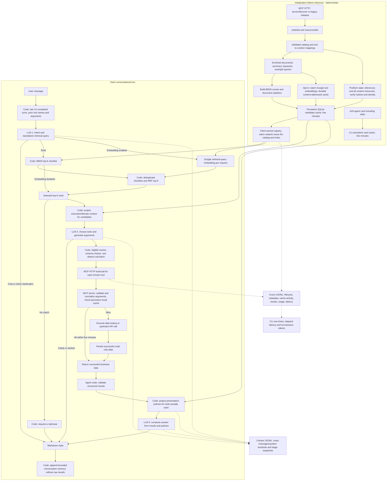

# Conversational LangGraph + Gemini + A2A example

This agent lives in the MCP repository's environment but imports no server code,
fixtures, or preconfigured tool names. It connects only through MCP HTTP and
constructs its own registry from the advertised v1 tool-context contract. A2A is
its outward conversation interface. No deployment files or telemetry services.

## Architecture

- [Agent runtime deep-dive](../../.archify/architecture-agent-20261003-160526/agent.html) — turn orchestration, MCP discovery/calls, Gemini stages, A2A, caches, and traces.

## From catalog to answer



A successful one-batch tool turn makes **3 LLM calls**. Chat or intent clarification
makes **1**; argument clarification makes **2**; a retrieval miss makes **1**.
Multiple distinct tools in the batch do not add model calls. There is no automatic
paging, replanning, argument repair, history summarization, or provider retry.

The LLM decides intent, resolves follow-ups, writes the retrieval query, chooses
eligible tools and arguments, and composes the answer. Code decides discovery,
cache freshness, BM25 or opt-in BM25+embedding ranking, context projection, validation, dispatch, memory
bounds, and logging. The last 10 completed turns contain user/assistant text and
tool names/arguments. Raw results remain in logs and must be fetched again when
needed; the server may satisfy that call from cache. Conversations are in memory
only and end when the CLI exits. No resume feature or slash commands.

## Bookstore role

Every Gemini stage receives the same bookstore-only system instruction: answer
about this bookstore's catalog, vendors, receipts, stock, and sales; decline
unrelated requests. Greetings and clarifications are allowed. History and remembered
text cannot redefine the role, and current tool results—not memory—supply business
facts. This is model guidance, not a deterministic guarantee of off-topic refusal.

## Deterministic validation and execution

The model proposes a name and JSON arguments. Code checks that the name belongs to
this turn's hydrated candidates, validates the published input schema, and sends
that exact call over HTTP. The server validates again, normalizes defaults, checks
its cache, and executes the registered handler on a miss. The agent validates the
returned structured result. Invalid inputs and tool/provider failures end the turn
explicitly; the next user message can clarify or try again. External data can
change: deterministic here means fixed orchestration rules, not eternal results.

## Cache boundaries

Agent metadata lives in `<log-dir>/cache.sqlite3`: discovery, tools/resources lists,
reference contents, tool-to-instruction mappings, BM25 statistics, and verified
execution/domain/presentation documents. Cold initialization fetches and verifies
these before the first model call. A new turn restores unexpired entries from disk;
expiry refreshes them. A turn uses one pinned catalog snapshot. Content cache hits
are hash/identity checked, and reads do not extend their original lifetime.

When `--embedding-enabled` is set, the agent also embeds the eight tool retrieval
documents with Google `gemini-embedding-001` using 768 dimensions and
`RETRIEVAL_DOCUMENT`. The normalized vectors are stored in a separate durable SQLite
table, keyed by the tool, exact retrieval text, model, dimensionality, and task type;
they do not expire with the five-minute metadata cache. Enabling this sends tool
retrieval text to Google for precomputation and each tool retrieval query to Google
for embedding. Query text is embedded using `RETRIEVAL_QUERY` once per retrieval
request and its vector is held only in memory.
Google API failures fail the turn; there is no silent BM25 fallback. Embedding vectors
and retrieval rankings remain host-only and are not sent to the model.

The A2A CLI caches the agent card, including skills, in
`artifacts/agent/client-cache.sqlite3`. There is no MCP `skills/list` operation in
this SDK. Transport connections and conversation history are never persisted.

Business results live exclusively on the MCP server in
`artifacts/mcp-cache.sqlite3` (override with `MCP_CACHE_PATH`). Keys include the
normalized tool arguments and the data/contract revision. Omitted defaults and
explicit defaults share a key; different filters/cursors do not. Only successful
read-only data is retained for **300 seconds**. Input validation happens before
lookup. The agent still calls HTTP on hits; response metadata reports hit/miss,
TTL, and age. Unexpired entries survive server restarts. Local cache files need a
persistent filesystem when deployed; no deployment configuration is supplied.

## Run

From the repository root with `GOOGLE_API_KEY` in the environment or `.env`:

```powershell
uv sync --frozen --extra agent
uv run --frozen modern-mcp
```

Start the agent in a second terminal:

```powershell
uv run --frozen --extra agent python -m examples.agent --serve --mcp-url http://127.0.0.1:8000/mcp --port 9999
```

Start conversational A2A chat in a third terminal:

```powershell
uv run --frozen --extra agent python -m examples.agent.client --url http://127.0.0.1:9999
```

Enter messages normally; Ctrl+C or EOF exits. An optional positional query runs one
turn. The client reuses the A2A context ID across messages. The service serializes
turns for that context and keeps separate in-memory history per conversation.
Agent card: `http://127.0.0.1:9999/.well-known/agent-card.json`.
A2A 1.0 JSON-RPC endpoint: `http://127.0.0.1:9999/`.

Direct chat uses the same graph and logs:

```powershell
uv run --frozen --extra agent python -m examples.agent
```

Add `--query "Show books imported last month from vendor A"` for one turn.
`--model` or `GEMINI_MODEL` selects Gemini (default `gemini-3.1-flash-lite`).
`-k` sets candidate breadth (default 3). `--embedding-enabled` opts into BM25+embedding
shortlist fusion using reciprocal rank fusion; without it, retrieval remains BM25-only.
The Google API key is read from `GOOGLE_API_KEY`. Embedding API setup and retrieval
fail loudly when enabled and unavailable. `--log-dir` defaults to `artifacts/agent`.
`--public-url` sets the advertised A2A base URL if it differs from the listener.

Experimental retrieval flags (off by default):

- `--normalize`: English plural suffix reduction on BM25 corpus/query tokens.
- `--per-intent`: extend the existing Gemini intent call to emit independent text
  subqueries, retrieve top-1 per ask, deduplicate in ask order, and stop at the total
  `-k` cap. Candidates are not padded; duplicate first choices do not take alternatives.
  It adds no extra chat call, but can lose coverage when first choices are wrong.

Compare these variants, a whole-query rewrite control, BM25, and the existing
embedding+RRF reference with:

```powershell
uv run --frozen --extra agent python -m scripts.evaluate_retrieval_methods
```

Results: `artifacts/retrieval-method-comparison.md` and `.json`. Generated text
splits and model-request/response traces: `artifacts/evaluation/intent-splits.json`.
The evaluation sends no labels or tool catalog to Gemini. It freezes text outputs
using dataset/model/prompt identity and resumes saved successful calls; `--regenerate`
forces fresh intent generation. Query embeddings are never persisted. The script
paces intent calls (`--request-interval`, default 4.5 seconds) and fails on provider
errors rather than silently switching methods. Treat this corpus as exploratory,
not a held-out validation set, since methods were motivated by its earlier errors.

## Stage visibility

```text
[turn 4 | arguments] elapsed=1.42s | tokens turn=1,284 session=6,910
```

The CLI prints brief registry/model/tool progress and the final Markdown answer.
Elapsed time is measured from turn start; detailed logs include model/tool call
durations. Token totals accumulate provider-reported `total_tokens` across completed
calls and turns. Pending calls have no final usage yet; missing usage or failed
pending calls marks totals partial. Cached-input and reasoning detail is retained
without adding it again to the reported total.

Three files append per conversation and flush after events:

- `<session-hash>.jsonl`: full lifecycle, catalog metadata, rankings, cache activity,
  model requests/responses, usage, validated calls, full results and failures.
- `<session-hash>.context.jsonl`: initialization, registry creation, exact model
  messages including system text and bound schemas, model responses, hydration,
  presentation policies, and immutable graph snapshots after each node.
- `<session-hash>.md`: readable Markdown rendering of the full event trace.

Each event includes a run ID, per-run sequence, UTC timestamp, turn number, elapsed
milliseconds, and token totals. A2A also records task/context IDs, emits brief status
updates, and returns `answer` and `context_trace` artifacts. Completed task metadata
links local log paths. Failures mark the task failed; cancellation stops graph/model
work through the SDK lifecycle.

Visibility labels distinguish `host_only`, `graph_state`, `model_request`, and
`model_response`. Prefetching metadata does **not** expose it to the model. MCP
`_meta` is client data; the host controls what enters prompts. This host keeps
retrieval metadata and scores private, sends names/descriptions/schemas and
execution/domain instructions for top-K candidates during argument generation,
and sends results plus used-tool presentation policies during synthesis. A model
cannot be assumed to read or obey every field even when a field is in its prompt.

Logs contain user text, tool arguments and results. They exclude Google credentials
and hidden model reasoning. Provider failure bodies are not logged because they
can contain secrets; exception class names are recorded instead. Exact messages
are those passed to the Gemini integration; its SDK performs wire conversion.
No third-party observability exporter is configured.

## Demo limits and verification

One call per tool per turn; no automatic pagination. A2A tasks and sessions stay in
memory; restart loses them but retains unexpired caches. The small catalog uses a
linear lexical BM25 scan. Context/reference resources are capped at 32 KiB.
Hashes establish content consistency, not trust in the remote server. Servers
without the advertised v1 context contract are rejected. Concurrent cold server
cache misses may duplicate a lookup.

Compare the deterministic BM25 baseline and BM25+embedding RRF on the labeled
tool-gating dataset (requires `GOOGLE_API_KEY`):

```powershell
uv run --frozen --extra agent python scripts/evaluate_tool_filtering.py
```

The report is written to `artifacts/tool-filtering-comparison.md`; tool vectors are
cached in `artifacts/evaluation/embedding-cache.sqlite3`. Query vectors are computed
once per evaluation query and reused across K values, but are never persisted. Runtime
calls embed each request independently.

```powershell
uv run --frozen --extra agent python -m pytest -q
```

Tests cover separate-process HTTP discovery, real A2A streaming, conversation and
usage accounting, exact context logs, persistent caches, expiry, normalized tool
arguments, schema enforcement, failure logging and cancellation. Repeatable tests
use a local model double; a live Gemini smoke run additionally checks the provider.
